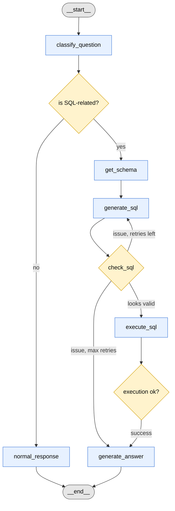

```mermaid
flowchart TD
    start([__start__]) --> classify[classify_question]
    classify --> branch{is SQL-related?}
    branch -->|no| chat[normal_response]
    branch -->|yes| schema[get_schema]

    schema --> gen[generate_sql]
    gen --> check{check_sql}
    check -->|looks valid| exec[execute_sql]
    check -->|issue, retries left| gen
    check -->|issue, max retries| answer
    exec --> route{execution ok?}
    route -->|success| answer[generate_answer]

    chat --> done([__end__])
    answer --> done([__end__])

    classDef decision fill:#fff3cd,stroke:#d39e00,color:#000;
    classDef node fill:#e7f1ff,stroke:#3d78d8,color:#000;
    classDef terminal fill:#e6e6e6,stroke:#666,color:#000;
    class branch,check,route decision;
    class classify,schema,gen,exec,answer,chat node;
    class start,done terminal;

```

<!-- LangGraph Text2SQL structure  -->